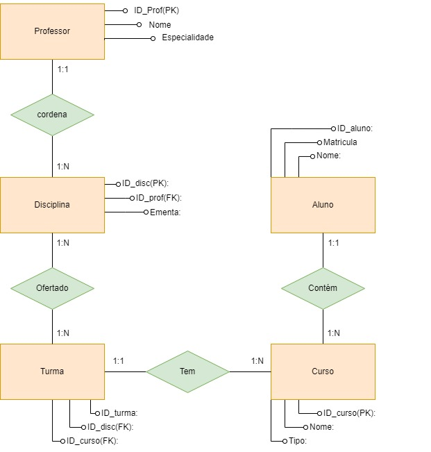

# Projeto Individual Módulo 4 Resilia

Projeto individual ao qual foi proposto a modelagem de um banco de dados que vai armazenar seus cursos, turmas e alunos.

Esse projeto teve como finalidade a aplicação do conceito de banco de dados e o uso da ferramenta MYSQL.

## :hammer_and_wrench: Ferramentas utilizadas
* Apache
* MYSQL
* diagrams.net
* XAMPP

## Perguntas a ser respondida
**Existem outras entidades além dessas três?**
R: Sim, além dessas, na minha modelagem criei as entidades Disciplina e Professor.

**Quais são os principais campos e tipos?**
R: De forma geral todos possuem o campo ID, que são gerados automatico a cada novo registro, sendo do tipo INT, e são de suma importancia para idenficação. Como exemplo tem-se na entidade turma os campos ID_turma(INT), ID_disc(INT), ID_curso(INT) e Data_inicio(Date).

**Como essas entidades estão relacionadas?**
R: Estão relacionadas através de chaves primárias e estrangeiras. E cada entidade possui uma relação de cardinalidade. Neste projeto está presente o 1:1 e 1:N. 

## Modelo Conceitual

## Modelo Lógico

